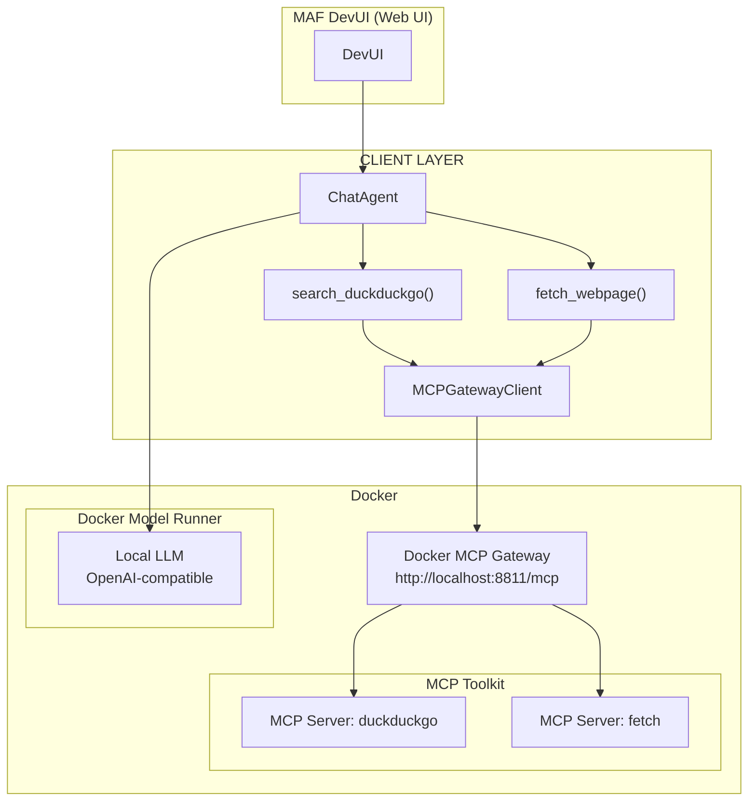

# Lab 04 — DevUI + Docker MCP Gateway (with DMR and Docker MCP)

> Microsoft Agent Framework (MAF) + DevUI + Docker MCP Gateway + Docker Model Runner (DMR).  
> Goal: run a **ChatAgent** inside **DevUI** that calls **MCP tools** (DuckDuckGo, Fetch) through a **stable streaming session**, without crashing the UI.

## What you’ll build

- A **DevUI** app hosting a **ChatAgent**.
- Two async “tools” (`search_duckduckgo`, `fetch_webpage`) exposed to the agent.
- A thin **`MCPGatewayClient`** that maintains a **persistent streaming session** to **Docker MCP Gateway**.
- Two Docker MCP servers enabled in the gateway: **duckduckgo** and **fetch**.
- **DMR** (Docker Model Runner) as the OpenAI-compatible LLM endpoint.

### Diagram


## Folder layout

```
.\ms-agent-framework-playground\labs\python\04_devui_with_mcp
│  devui_async.py
│  devui_patch.py
│  docker-compose.yml
│  echo.py
│  main.py                # ✅ working implementation (use this)
│  mcp_gateway_agent.py   # MCPGatewayClient + tool wrappers
│  non_working_1.py       # ❌ MCPStdioTool inside DevUI (crashes)
│  non_working_2.py       # ❌ MCPStreamableHTTPTool inside DevUI (also breaks)
│  requirements.txt
└─ 
```

> **Use `main.py`**. The `non_working_*` files document dead ends: DevUI can’t serialize MCP streaming content types (`TextContent`, `FunctionResultContent`, …) and the UI dies.

## Prerequisites

* Python 3.12+
* Docker Desktop (or compatible)
* DMR (Docker Model Runner) running and exposing an OpenAI-compatible endpoint
  Example: `http://localhost:12434/engines/llama.cpp/v1`

## Quick start

1. **Start MCP Gateway (Docker)**

```bash
docker compose up -d
# exposes http://localhost:8811/mcp and mounts docker.sock
```

`docker-compose.yml` (excerpt):

2. **Create venv and install deps**

```bash
python -m venv .venv
./.venv/Scripts/activate  # Windows
# source .venv/bin/activate   # macOS/Linux

pip install -r requirements.txt
```

3. **Set your environment variables**

The code uses these values as defults, so, not mandatory... And if you launch it via VSCode, you can use the .env file at the project root (Don't blame on me, I just kept it for learning purposes).

```bash
$env:MCP_GATEWAY_URL = "http://localhost:8811/mcp"
$env:OPENAI_API_BASE = "http://localhost:12434/engines/llama.cpp/v1"
$env:OPENAI_API_KEY  = "none"
$env:MODEL_ID        = "ai/gpt-oss:latest"
```

4. **Run DevUI**

```bash
python main.py
# DevUI at http://localhost:8000
```

5. **Try a prompt in DevUI**

```
Research Docker Model Runner and summarize how it can be combined with Microosft Agent Framework.
```

## How it works (short)

* `MCPGatewayClient` opens a **single streaming session** to the gateway using `streamablehttp_client` + `ClientSession`.
* Tool wrappers (`search_duckduckgo`, `fetch_webpage`) call `session.call_tool(...)` and **flatten** content to plain strings.
* The **ChatAgent** receives those wrappers as **normal async tools** — DevUI never sees MCP’s streaming types.
* Result: DevUI remains stable; MCP calls work; the agent can chain search → fetch.

## Why the other approaches failed

* **`non_working_1.py` (MCPStdioTool inside DevUI)**
  DevUI throws:
  `Unable to serialize unknown type: <class 'agent_framework._types.TextContent'>`
  Browser: `Uncaught TypeError: can't access property "replace", e.type is undefined`

* **`non_working_2.py` (MCPStreamableHTTPTool inside DevUI)**
  Similar outcome. Root cause: DevUI’s streaming engine (`_stream_execution`) can’t serialize **MCP streaming content blocks**.

> Workaround (this lab): **own the MCP session**, wrap into plain async fns, and run DevUI in a controlled `uvicorn` loop.

## Tips

* If using DMR with small context windows, see your model’s context settings and bump as needed. You can [see this PR](https://github.com/docker/model-runner/pull/243) by Docker Model Runner team. or use [this script](..\..\dotnet\set-model-context-size.ps1) with `./set-model-context-size.ps1 -m ai/gpt-oss -t 64000` with your prefered model and size.

## Cleanup

```bash
docker compose down
deactivate
```
I hope this examples help you learn and use these amazing tools and frameworks.